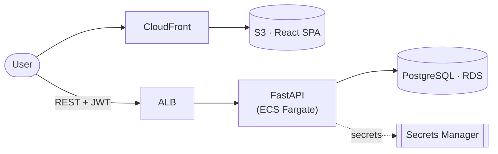

# Prabha HRMS

A full-stack Human Resource Management System — built as an end-to-end industry-practice
learning project. Manages the employee lifecycle: GPS-based attendance, leave, and payroll,
with role-based dashboards (Admin / Manager / Employee).

> **Note on the requirements doc:** `Prabha_HRMS_Client_Requirements.docx` originally specified a
> single-file Firebase app on GitHub Pages. This repo keeps the **functional/domain requirements**
> from that doc but implements them as a **proper full stack** (real API + DB + AWS + Terraform + CI/CD)
> for learning purposes.

## Architecture



Provisioned by **Terraform** · deployed by **GitHub Actions** (OIDC, no static keys).
Full diagrams (auth flow, GPS rules, payroll, data model, AWS topology, CI/CD) live in
[`docs/ARCHITECTURE.md`](docs/ARCHITECTURE.md). Deployment steps in
[`docs/DEPLOYMENT.md`](docs/DEPLOYMENT.md).

## Stack

| Layer    | Choice                                         |
|----------|------------------------------------------------|
| Frontend | React 18 + Vite + TypeScript                   |
| Backend  | Python + FastAPI + SQLAlchemy + Alembic        |
| Database | PostgreSQL                                     |
| Auth     | 4-digit PIN (hashed) → JWT, role-based access  |
| Compute  | AWS ECS Fargate behind an ALB                  |
| IaC      | Terraform (S3+DynamoDB remote state)           |
| CI/CD    | GitHub Actions (OIDC → AWS)                    |

## Monorepo layout

```
apps/api/    FastAPI backend (models, services, routers, tests, Alembic)
apps/web/    React + Vite + TypeScript SPA
infra/       Terraform modules + dev/prod environments
.github/     CI/CD workflows
docker-compose.yml   Local dev: postgres + api + web
```

## Local development

Prerequisites: Docker + Docker Compose.

```bash
make up        # start postgres + api + web
make seed      # seed ~34 employees (admin EMP008 / PIN 1234)
make test      # run backend tests
make down      # stop everything
```

- API:  http://localhost:8000  (docs at `/docs`)
- Web:  http://localhost:5173

## Roles & seed logins

| Role     | Employee           | PIN  |
|----------|--------------------|------|
| Admin    | EMP008 (Neelam)    | 1234 |
| Manager  | EMP006 (Tushar)    | seed |
| Manager  | EMP007 (Ganesh)    | seed |
| Employee | all others         | seed |

## Documentation

- Build plan: see the approved plan file referenced in project docs.
- Acceptance criteria: derived from the client requirements doc (20 criteria), covered by backend tests.
