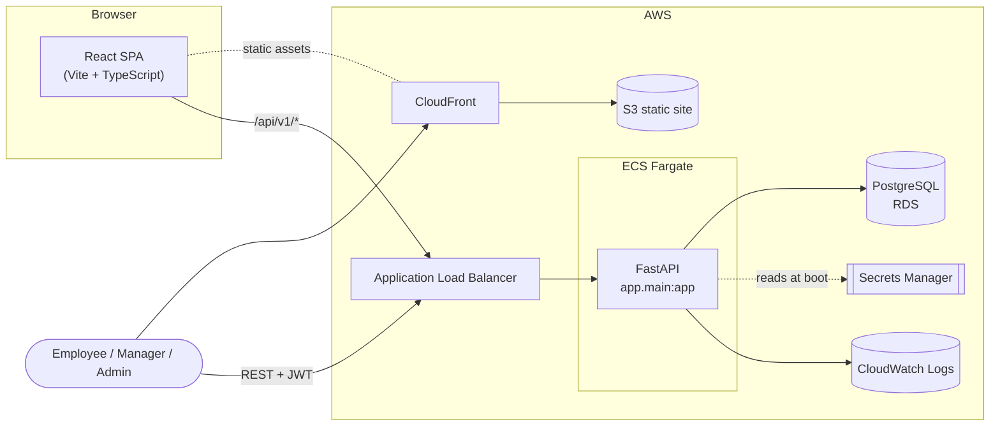
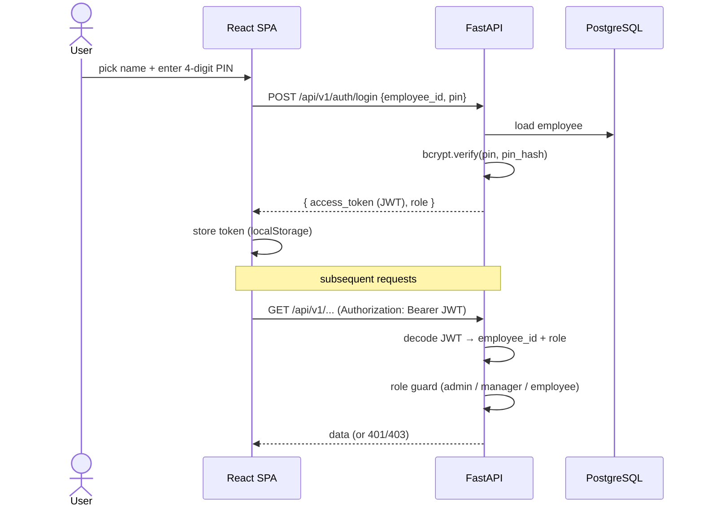
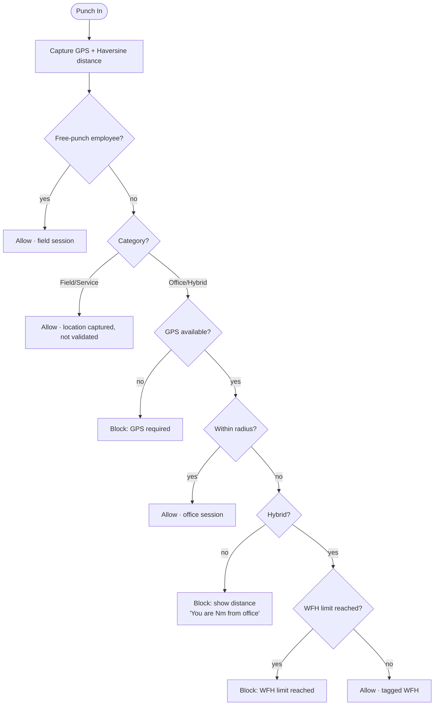
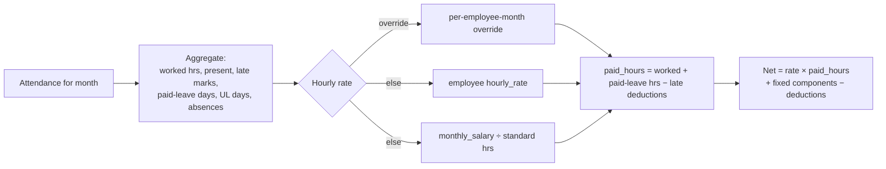
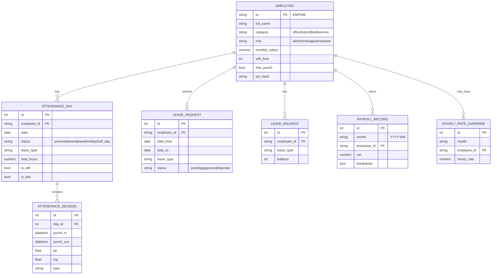
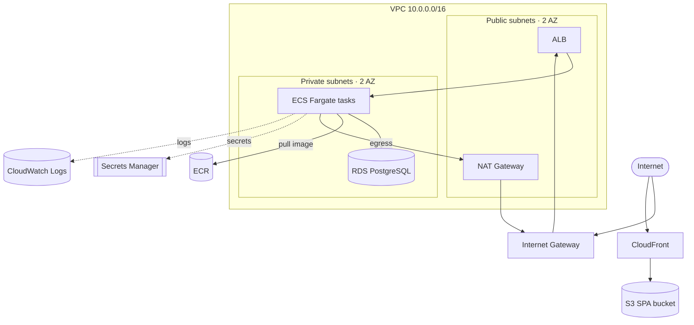
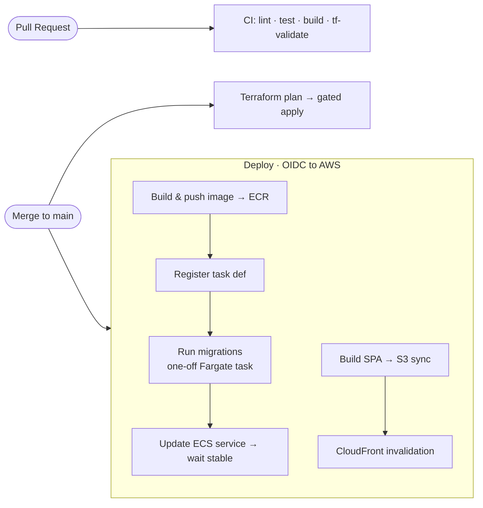
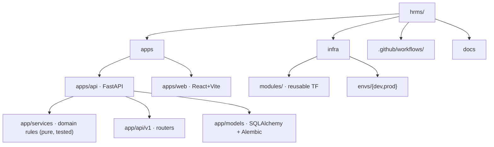

# Architecture

Prabha HRMS is a full-stack HRMS: a React SPA talking to a FastAPI backend over a
JWT-authenticated REST API, backed by PostgreSQL, deployed to AWS with Terraform and
shipped by GitHub Actions.

> **Context:** the original `Prabha_HRMS_Client_Requirements.docx` asked for a single-file
> Firebase app. This project keeps the *domain requirements* from that doc but implements
> them as a proper full stack for end-to-end learning.

---

## 1. System overview

- The **SPA** is served as static files from S3 via CloudFront.
- The **API** runs as containers on ECS Fargate behind an ALB, in private subnets.
- **Secrets** (DB URL, JWT signing key) are injected from Secrets Manager at task start.
- The browser holds a **JWT** and sends it on every API call.

---

## 2. Request authentication flow

Roles come from the employee record, not the token issuer. Guards live in
`apps/api/app/core/deps.py` (`require_admin`, `require_manager`).

---

## 3. GPS punch decision (doc §7, §9)

The category-aware rules are a pure function — `apps/api/app/services/gps.py::evaluate_punch`.

---

## 4. Payroll calculation (doc §11)

`apps/api/app/services/payroll.py::compute_payslip` — pure, fully unit-tested.

Absences and unpaid leave contribute zero worked hours, so they reduce pay pro-rata
naturally; paid leave is credited as a normal working day; late marks beyond the free
allowance deduct one hour each.

---

## 5. Data model

App-level settings (office coords, radius, late cutoff, working hours, holidays) live in a
singleton `app_settings` row.

---

## 6. AWS infrastructure (Terraform)

Modules in `infra/modules/`: `network`, `ecr`, `rds`, `alb`, `ecs`, `secrets`, `frontend`,
`iam_oidc`. Composed per environment in `infra/envs/{dev,prod}`. The app security group is
created in the composition (not the ECS module) to break the ECS↔RDS dependency cycle.

---

## 7. CI/CD pipeline (GitHub Actions)

CI authenticates to AWS via **GitHub OIDC** (no long-lived keys). See
[`DEPLOYMENT.md`](DEPLOYMENT.md) for the required repository variables.

---

## 8. Monorepo layout

